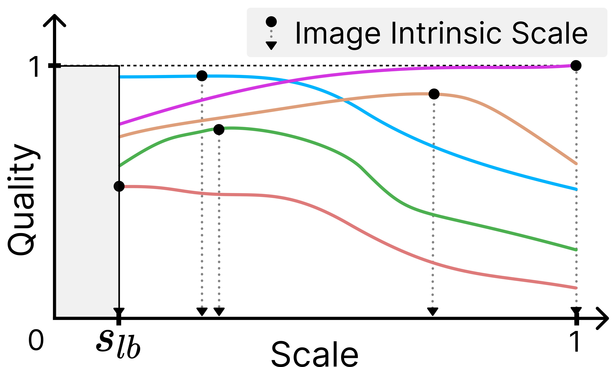

# IISA (ICCV 2025)
### Image Intrinsic Scale Assessment: Bridging the Gap Between Quality and Resolution
[**Vlad Hosu**](https://scholar.google.com/citations?user=IzTZ1tAAAAAJ&hl=en)**\***,
[**Lorenzo Agnolucci**](https://scholar.google.com/citations?user=hsCt4ZAAAAAJ&hl=en)**\***,
[**Daisuke Iso**](https://scholar.google.com/citations?hl=en&user=VZ-25XwAAAAJ),
[**Dietmar Saupe**](https://scholar.google.com/citations?user=9CK8xEgAAAAJ&hl=en),

**\*** Equal contribution.

[](https://arxiv.org/abs/2502.06476)
[](https://database.mmsp-kn.de/iisa-database.html)
[](https://github.com/SonyResearch/IISA)

This is the **official repository** of the [**ICCV 2025 paper**](https://arxiv.org/abs/2502.06476) "*Image Intrinsic Scale Assessment: Bridging the
Gap Between Quality and Resolution*".

## Overview
<p align="center">
  
  
</p>


> **Abstract**: <br>
> Image Quality Assessment (IQA) measures and predicts perceived image quality by human observers. Although recent
> studies have highlighted the critical influence that variations in the scale of an image have on its perceived quality,
> this relationship has not been systematically quantified.
> To bridge this gap, we introduce the Image Intrinsic Scale (IIS), defined as the largest scale where an image exhibits
> its highest perceived quality. We also present the Image Intrinsic Scale Assessment (IISA) task, which involves
> subjectively measuring and predicting the IIS based on human judgments. We develop a subjective annotation methodology
> and create the IISA-DB dataset, comprising 785 image-IIS pairs annotated by experts in a rigorously controlled
> crowdsourcing study with verified reliability. Furthermore, we propose WIISA (Weak-labeling for Image Intrinsic Scale 
> Assessment), a strategy that leverages how the IIS of an image varies with downscaling to generate weak labels. 
> Experiments show that applying WIISA during the training of several IQA methods adapted for IISA consistently improves
> the performance compared to using only ground-truth labels.

## Citation
If you find our work useful, please cite our paper:
```bibtex
@inproceedings{hosu2025image,
  title={Image Intrinsic Scale Assessment: Bridging the Gap Between Quality and Resolution},
  author={Hosu, Vlad and Agnolucci, Lorenzo and Iso, Daisuke and Saupe, Dietmar},
  booktitle={Proceedings of the IEEE/CVF International Conference on Computer Vision (ICCV)},
  year={2025}
}
```

## IISA-DB Dataset
We introduce the **IISA-DB** dataset, which contains 785 image-IIS pairs annotated by experts in a rigorously controlled
crowdsourcing study with verified reliability. The dataset is available for download from 
[here](https://database.mmsp-kn.de/iisa-database.html). In our experiments, we randomly partition the dataset into 70% training,
10% validation, and 20% testing sets over 10 different splits. The splits are available in ```datasets/splits```.

The dataset class is implemented in ```pyiqa/data/iisadb_dataset.py```. The code supports loading the dataset and 
generating weak labels for training using the WIISA strategy proposed in our paper.

## Getting Started

### Installation

```bash
git clone https://github.com/SonyResearch/IISA.git
cd IISA
python -m venv venv
source venv/bin/activate
pip install -r requirements.txt
python setup.py develop
```

### Data Preparation

After downloading the IISA-DB dataset, ensure that the folder structure matches the following:

```
├── IISA-DB
│   annotations.csv

│   ├── images
|   |   ├── [374612387.jpg | 6246977871.jpg | 9470847928.jpg | ...]
```


## Inference with Pre-trained Models
Thanks to [torch.hub](https://pytorch.org/docs/stable/hub.html), you can leverage our pre-trained checkpoints for
inference without the need to clone our repo. The code snippet below shows how to run inference with models pre-trained
on the IISA-DB dataset. You have to change ```<METRIC_NAME>``` with one of the following: 
- ```arniqa```: [ARNIQA](https://arxiv.org/abs/2310.14918)
- ```clipiqa```: [CLIPIQA](https://arxiv.org/abs/2207.12396)
- ```contrique```: [CONTRIQUE](https://arxiv.org/abs/2110.13266)
- ```dbcnn```: [DBCNN](https://arxiv.org/abs/1907.02665)
- ```qualiclip```: [QualiCLIP](https://arxiv.org/abs/2403.11176)
- ```topiq```: [TOPIQ](https://arxiv.org/abs/2308.03060)

```python
import pyiqa
from PIL import Image
from torchvision.transforms import ToTensor
import torch

device = torch.device("cuda") if torch.cuda.is_available() else torch.device("cpu")

# Load the pre-trained model
model = torch.hub.load(repo_or_dir="SonyResearch/IISA", model="<METRIC_NAME>", device=device)    # The model is already in evaluation mode

# Option 1: Inference using image tensor
img = Image.open('assets/example_image.jpg').convert('RGB')
img_tensor = ToTensor()(img).unsqueeze(0).to(device)    # The models expect non-normalized batched image tensors

with torch.no_grad():
    pred = model(img_tensor)

print('Predicted IIS from tensor: ', pred.item())

# Option 2: Inference using image path
pred = model('assets/example_image.jpg')
print('Predicted IIS from path: ', pred.item())
```

## Training
To train a model on the IISA-DB dataset, you have to first modify the ```dataset_path``` variable in the corresponding 
config file under the ```configs/``` directory to point to the location of the dataset on your machine, such as
```/home/IISA-DB```. Optionally, you can also modify the ```logger.wandb``` variable to enable logging with
[Weights & Biases](https://wandb.ai/). 

Then, run the following command to cross-validate the model on 10 splits, using the checkpoint with the best validation
performance to evaluate the model on the test set:
```python
python pyiqa/train_nsplits.py -opt configs/train_<MODEL_NAME>_iisadb.yml
```
where ```<MODEL_NAME>``` can be one of the following: [ARNIQA](https://arxiv.org/abs/2310.14918),
[CLIPIQA](https://arxiv.org/abs/2207.12396), [CONTRIQUE](https://arxiv.org/abs/2110.13266), 
[DBCNN](https://arxiv.org/abs/1907.02665), [QualiCLIP](https://arxiv.org/abs/2403.11176) and 
[TOPIQ](https://arxiv.org/abs/2308.03060).

Alternatively, you can train the model on a single split by running:
```python 
python train.py -opt configs/train_<MODEL_NAME>_iisadb.yml
```

## Acknowledgements
Our code is based on the [**IQA-PyTorch**](https://github.com/chaofengc/IQA-PyTorch) library. We thank the authors for
their contribution.